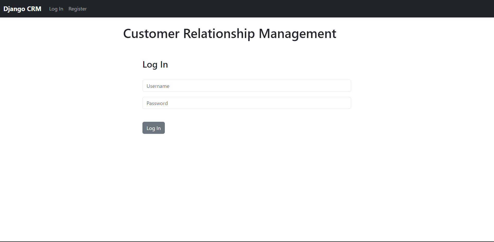
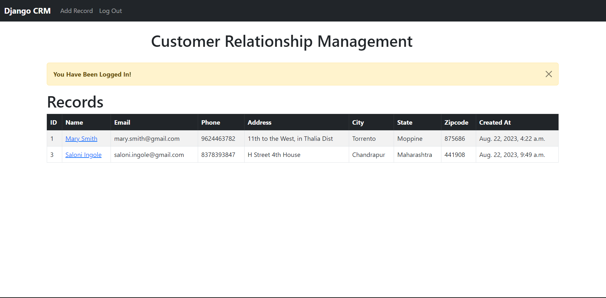
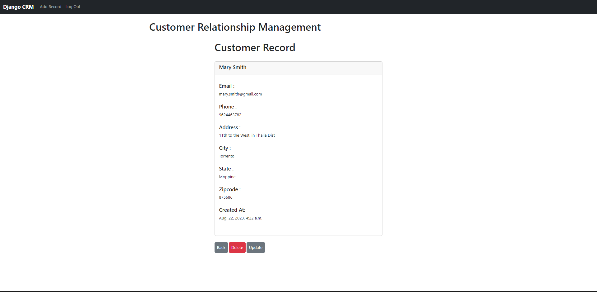

# Customer Relationship Management (CRM)

In this  we have build a CRM (Customer Relationship Management) App with Django, Python, and MySQL.

The app will use MySQL for the database.  We'll be able to Register, Log In, Log Out, Add Records, View Records, Update Records, and Delete Records.

